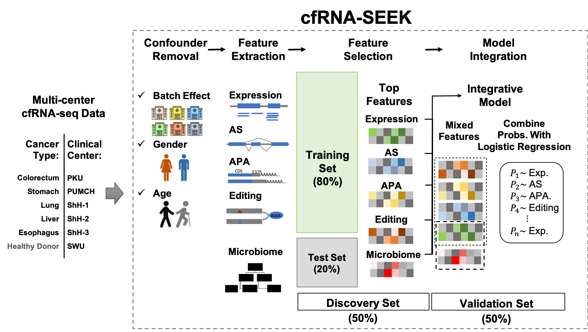

# cfRNA-SEEK

> Website hosted by github page: https://lulab.github.io/cfRNA-SEEK

## Scripts for cfRNA Sequencing Data Analysis

This repo contains scripts used in cfRNA-SEEK, a pipeline for identification of cancer relevant features from cfRNA sequencing (cfRNA-seq) data generated by SMART-Total protocol.  Scripts for small cfRNA-seq data processing are also available.
We also provide [snakemake files](https://github.com/lulab/cfRNA-SEEK/blob/master/snakefiles/) to tidy up the scripts.

- **SMART-total cfRNA-seq Reads Processing**

To quantify different RNA variations for human genome, as well as the abundance of different microbial taxa, see [analysis-step-smart-total-libraries.md](analysis-step-smart-total-libraries.md).

- **Feature Selection**

To nomalize data matrix, remove batch effect, identify cancer relevant features and evaluate the classification performance, see [classification.md](classification.md).

- **Small cfRNA-seq Reads Processing**

To analyze small cfRNA-seq data, see [analysis-step-small-RNA-libraries.md](analysis-step-small-RNA-libraries.md).

---

- Dependency

  | program  | version | purpose                               |
  | -------- | ------- | ------------------------------------- |
  | cutadapt | 2.3     | Trim adaptor and low quality sequence |
  | STAR     | 2.5.3a_modified |Reads alignment|
  | bowtie2  | 2.3.5 | Reads alignment |
  | MarkDuplicates (picard toolkit)|2.20.0|Duplication removal|
  | samtools | 1.9 | Manipulation of bam file, quanltification of editing level |
  | bedtools |2.28.0 |Assign mapped reads to different genomic regions|
  | rMATs | 4.0.2 | Alternative splicing analysis |
  | featureCounts | 1.6.2 | Quantify gene expression | 
  | DaPar | 0.91 | APA analysis | 
  | RNAeditor | 1.0 | Identify RNA editing sites | 
  | edgeR | 3.24.3 | Normalization and differential expression analysis | 
  | RUVSeq | 1.6.1 | Normalization use control genes | 
  | scipy | 1.4.1 | Perform ranksum test| 
  | sklearn | 0.22.2 | Feature selection and performance evaluation | 
  | skrebate | 0.6 | For SURF based feature selection |
  | imblearn | 0.6.2 | Implements a balanced random forest classifier | 

> Illustration of cfRNA-SEEK work flow

